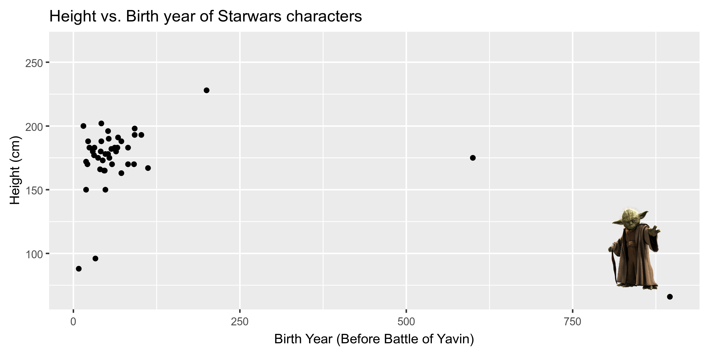

```{r child = "setup.Rmd"}
```

```{r packages, echo=FALSE, message=FALSE, warning=FALSE}
library(tidyverse)
library(magick)
library(knitr)
library(icons)
```

class: top

## Workshop guidelines

.pull-left[
- **Help** is always available.
  - Use the Zoom chat (private or public) to ask a question.
  - Raise your hand `r emo::ji('raised_back_of_hand')`.
  - And you can always un-mute and ask.
]

.pull-right[
<blockquote>
Help will always be given at Hogwarts to those who ask for it.
.right[-- <cite>Albus Dumbledore</cite>]
</blockquote>
]

---

class: middle

# Data visualization

---

## Data visualization

> *"The simple graph has brought more information to the data analyst’s mind than any other device." — John Tukey*

- Data visualization is the creation and study of the visual representation of data.
- There are many tools for visualizing data (R is one of them), and many approaches/systems within R for making data visualizations (**ggplot2** is one of them, and that's what we're going to use).

---

## ggplot2 $\in$ tidyverse

.pull-left[
```{r echo=FALSE, out.width="80%",fig.align="center"}
knitr::include_graphics("img/ggplot2-part-of-tidyverse.png")
```
]
.pull-right[
```{r message=FALSE}
library(tidyverse)
```
- **ggplot2** is tidyverse's data visualization package
- The `gg` in "ggplot2" stands for Grammar of Graphics
- It is inspired by the book **Grammar of Graphics** by Leland Wilkinson
]

---

## Grammar of Graphics

A grammar of graphics is a tool that enables us to concisely describe the components of a graphic.

```{r echo=FALSE, out.width="60%",fig.align="center"}
knitr::include_graphics("img/grammar-of-graphics.png")
```

.footnote[ 
Source: [BloggoType](http://bloggotype.blogspot.com/2016/08/holiday-notes2-grammar-of-graphics.html)
]

---

## Hello ggplot2!

- `ggplot()` is the main function in ggplot2 
- Plots are constructed in layers
- Structure of the code for plots can be summarized as
```{r eval = FALSE}
ggplot(data = [dataset], 
       mapping = aes(x = [x-variable], y = [y-variable])) +
   geom_xxx() +
   other options
```
- For help with the ggplot2
  + [ggplot2.tidyverse.org](http://ggplot2.tidyverse.org/)
  + [ggplot cheat sheet](https://github.com/rstudio/cheatsheets/blob/master/data-visualization-2.1.pdf)

---

.panelset[
.panel[.panel-name[Code]

```{r eval=FALSE}
ggplot(data = starwars, 
       mapping = aes(x = height, y = mass)) +
  geom_point() +
  labs(title = "Mass vs. height of Starwars characters",
       x = "Height (cm)", y = "Weight (kg)")
```
]
.panel[.panel-name[Plot]

```{r out.width="60%", echo=FALSE, message=FALSE}
ggplot(data = starwars, 
       mapping = aes(x = height, y = mass)) +
  geom_point() +
  labs(title = "Mass vs. height of Starwars characters",
       x = "Height (cm)", y = "Weight (kg)")
```
]]

---

## Parameters of a full ggplot2 visualization:

- `data`: the data frame to be plotted
- `geometry`: how the data is to be displayed (e.g., scatterplot, barplot, etc.)
- `mapping`: how the properties of the data map to the properties of the geometry (e.g., which columns map to X and Y coordinates)
- `stat`: the transformation to apply to the data (e.g., count the number of observations)
- `position`: how to adjust the positions of displayed elements (e.g., jittering points in a scatterplot)
- `coordinate`: whether to use Cartesian coordinates or polar coordinates
- `facet`: how to subset the data to create multiple subplots
- `theme`: themes control the display of all non-data elements of the plot

---

class: middle

# Visualizing Star Wars

```{r eval = FALSE}
dplyr::starwars
```
---

## Dataset terminology

- Each row is an **observation**
- Each column is a **variable**

```{r message=FALSE, echo=FALSE}
options(width=90)
starwars
```

---

## Luke Skywalker


---

## What's in the Star Wars data?

```{r}
glimpse(starwars)
```

---

## Another look at Star Wars data

.pull-left[
The **skimr** package provides summary statistics the user can skim quickly to 
understand their data.
```{r eval=FALSE}
library(skimr)
skim(starwars)
```
]
.pull-right[
```{r echo=FALSE, out.width="50%", fig.align="center"}
knitr::include_graphics("img/skimr.png")
```
]

---

.xsmall[
```{r message=FALSE, results="md", echo=FALSE, render = normal_print}
options(width=120)
library(skimr)
skim(starwars)
```
]

---

## What's in the Star Wars data?

.pull-left[
.discussion[
How many rows and columns does this dataset have? What does each row represent? What does each column represent?
]
```{r eval = FALSE}
?starwars
```
]
.pull-right[
```{r echo=FALSE, out.width="100%"}

```
]

---

.your-turn[
- Answer the questions for `Your Turn 1 - Explore the data`
  - How many **variables** are present in the `starwars` data?
  - How many **observations** are present in the `starwars` data?
  - How many **numeric** variables are present? What are they?
]

```{r echo=FALSE}
countdown(minutes = 2, seconds = 00)
```

---

class: middle

# Building a Plot Layer by Layer

---

- Start with the `starwars` dataframe

.pull-left[

```{r out.width = "50%", eval=FALSE}
ggplot(data = starwars) #<<
```
]

.pull-right[
```{r out.width="100%", echo=FALSE, warning=FALSE, message=FALSE}
ggplot(data = starwars)
```
]

---

- Start with the `starwars` dataframe, map `height` to the x-axis

.pull-left[

```{r out.width = "50%", eval=FALSE}
ggplot(data = starwars,
       mapping = aes(x = height)) #<<
```
]

.pull-right[
```{r out.width="100%", echo=FALSE, warning=FALSE, message=FALSE}
ggplot(data = starwars,
       mapping = aes(x = height))
```
]

---

- Start with the `starwars` dataframe, map `height` to the x axis and `mass` to the y-axis

.pull-left[

```{r out.width = "50%", eval=FALSE}
ggplot(data = starwars,
       mapping = aes(x = height,
                     y = mass)) #<<
```
]

.pull-right[
```{r out.width="100%", echo=FALSE, warning=FALSE, message=FALSE}
ggplot(data = starwars,
       mapping = aes(x = height,
                     y = mass))
```
]

---

- Start with the `starwars` dataframe, map `height` to the x axis and `mass` to the y-axis. Represent each observation with a point.

.pull-left[

```{r out.width = "50%", eval=FALSE}
ggplot(data = starwars,
       mapping = aes(x = height,
                     y = mass)) + 
  geom_point() #<<
```
]

.pull-right[
```{r out.width="100%", echo=FALSE, warning=FALSE, message=FALSE}
ggplot(data = starwars,
       mapping = aes(x = height,
                     y = mass)) +
  geom_point()
```
]

---

- Start with the `starwars` dataframe, map `height` to the x axis and `mass` to the y-axis. Represent each observation with a point and map `gender` to the color of each point

.pull-left[

```{r out.width = "50%", eval=FALSE}
ggplot(data = starwars,
       mapping = aes(x = height,
                     y = mass,
                     color = gender)) + #<<
  geom_point()
```
]

.pull-right[
```{r out.width="100%", echo=FALSE, warning=FALSE, message=FALSE}
ggplot(data = starwars,
       mapping = aes(x = height,
                     y = mass,
                     color = gender)) +
  geom_point()
```
]

---

- Start with the `starwars` dataframe, map `height` to the x axis and `mass` to the y-axis. Represent each observation with a point and map `gender` to the color of each point and scale each point by the `birth_year` of the observation.

.pull-left[

```{r out.width = "50%", eval=FALSE}
ggplot(data = starwars,
       mapping = aes(x = height,
                     y = mass,
                     color = gender,
                     size = birth_year)) + #<<
  geom_point()
```
]

.pull-right[
```{r out.width="100%", echo=FALSE, warning=FALSE, message=FALSE}
ggplot(data = starwars,
       mapping = aes(x = height,
                     y = mass,
                     color = gender,
                     size = birth_year)) +
  geom_point()
```
]
---

- Start with the `starwars` dataframe, map `height` to the x axis and `mass` to the y-axis. Represent each observation with a point and map `gender` to the color of each point and scale each point by the `birth_year` of the observation. Title the plot "Mass vs. height of Starwars characters".

.pull-left[

```{r out.width = "50%", eval=FALSE}
ggplot(data = starwars,
       mapping = aes(x = height,
                     y = mass,
                     color = gender,
                     size = birth_year)) + 
  geom_point() +
  labs(title = "Mass vs. height of Starwars  characters") #<<
```
]

.pull-right[
```{r out.width="100%", echo=FALSE, warning=FALSE, message=FALSE}
ggplot(data = starwars,
       mapping = aes(x = height,
                     y = mass,
                     color = gender,
                     size = birth_year)) +
  geom_point() +
  labs(title = "Mass vs. height of Starwars characters")
```
]

---

- Start with the `starwars` dataframe, map `height` to the x axis and `mass` to the y-axis. Represent each observation with a point and map `gender` to the color of each point and scale each point by the `birth_year` of the observation. Title the plot "Mass vs. height of Starwars characters" and add the subtitle "by gender and birth year".

.pull-left[

```{r out.width = "50%", eval=FALSE}
ggplot(data = starwars,
       mapping = aes(x = height,
                     y = mass,
                     color = gender,
                     size = birth_year)) + 
  geom_point() +
  labs(title = "Mass vs. height of Starwars characters",
       subtitle = "by gender and birth year") #<<
```
]

.pull-right[
```{r out.width="100%", echo=FALSE, warning=FALSE, message=FALSE}
ggplot(data = starwars,
       mapping = aes(x = height,
                     y = mass,
                     color = gender,
                     size = birth_year)) +
  geom_point() +
  labs(title = "Mass vs. height of Starwars characters",
       subtitle = "by gender and birth year")
```
]

---

- Start with the `starwars` dataframe, map `height` to the x axis and `mass` to the y-axis. Represent each observation with a point and map `gender` to the color of each point and scale each point by the `birth_year` of the observation. Title the plot "Mass vs. height of Starwars characters" and add the subtitle "by gender and birth year". Label the x-axis "Height (cm)"

.pull-left[

```{r out.width = "50%", eval=FALSE}
ggplot(data = starwars,
       mapping = aes(x = height,
                     y = mass,
                     color = gender,
                     size = birth_year)) + 
  geom_point() +
  labs(title = "Mass vs. height of Starwars characters",
       subtitle = "by gender and birth year",
       x = "Height (cm)") #<<
```
]

.pull-right[
```{r out.width="100%", echo=FALSE, warning=FALSE, message=FALSE}
ggplot(data = starwars,
       mapping = aes(x = height,
                     y = mass,
                     color = gender,
                     size = birth_year)) +
  geom_point() +
  labs(title = "Mass vs. height of Starwars characters",
       subtitle = "by gender and birth year",
       x = "Height (cm)")
```
]

---

- Start with the `starwars` dataframe, map `height` to the x axis and `mass` to the y-axis. Represent each observation with a point and map `gender` to the color of each point and scale each point by the `birth_year` of the observation. Title the plot "Mass vs. height of Starwars characters" and add the subtitle "by gender and birth year". Label the x-axis "Height (cm)" and the y-axis "Weight (kg)".

.pull-left[

```{r out.width = "50%", eval=FALSE}
ggplot(data = starwars,
       mapping = aes(x = height,
                     y = mass,
                     color = gender,
                     size = birth_year)) + 
  geom_point() +
  labs(title = "Mass vs. height of Starwars characters",
       subtitle = "by gender and birth year",
       x = "Height (cm)",
       y = "Weight (kg)") #<<
```
]

.pull-right[
```{r out.width="100%", echo=FALSE, warning=FALSE, message=FALSE}
ggplot(data = starwars,
       mapping = aes(x = height,
                     y = mass,
                     color = gender,
                     size = birth_year)) +
  geom_point() +
  labs(title = "Mass vs. height of Starwars characters",
       subtitle = "by gender and birth year",
       x = "Height (cm)",
       y = "Weight (kg)")
```
]

---

- Start with the `starwars` dataframe, map `height` to the x axis and `mass` to the y-axis. Represent each observation with a point and map `gender` to the color of each point and scale each point by the `birth_year` of the observation. Title the plot "Mass vs. height of Starwars characters" and add the subtitle "by gender and birth year". Label the x-axis "Height (cm)" and the y-axis "Weight (kg)". Label the color legend "Gender"

.pull-left[

```{r out.width = "50%", eval=FALSE}
ggplot(data = starwars,
       mapping = aes(x = height,
                     y = mass,
                     color = gender,
                     size = birth_year)) + 
  geom_point() +
  labs(title = "Mass vs. height of Starwars characters",
       subtitle = "by gender and birth year",
       x = "Height (cm)",
       y = "Weight (kg)",
       color = "Gender") #<<
```
]

.pull-right[
```{r out.width="100%", echo=FALSE, warning=FALSE, message=FALSE}
ggplot(data = starwars,
       mapping = aes(x = height,
                     y = mass,
                     color = gender,
                     size = birth_year)) +
  geom_point() +
  labs(title = "Mass vs. height of Starwars characters",
       subtitle = "by gender and birth year",
       x = "Height (cm)",
       y = "Weight (kg)",
       color = "Gender")
```
]

---

- Start with the `starwars` dataframe, map `height` to the x axis and `mass` to the y-axis. Represent each observation with a point and map `gender` to the color of each point and scale each point by the `birth_year` of the observation. Title the plot "Mass vs. height of Starwars characters" and add the subtitle "by gender and birth year". Label the x-axis "Height (cm)" and the y-axis "Weight (kg)". Label the color legend "Gender" and the size legend "Birth year".

.pull-left[

```{r out.width = "50%", eval=FALSE}
ggplot(data = starwars,
       mapping = aes(x = height,
                     y = mass,
                     color = gender,
                     size = birth_year)) + 
  geom_point() +
  labs(title = "Mass vs. height of Starwars characters",
       subtitle = "by gender and birth year",
       x = "Height (cm)",
       y = "Weight (kg)",
       color = "Gender",
       size = "Birth year") #<<
```
]

.pull-right[
```{r out.width="100%", echo=FALSE, warning=FALSE, message=FALSE}
ggplot(data = starwars,
       mapping = aes(x = height,
                     y = mass,
                     color = gender,
                     size = birth_year)) +
  geom_point() +
  labs(title = "Mass vs. height of Starwars characters",
       subtitle = "by gender and birth year",
       x = "Height (cm)",
       y = "Weight (kg)",
       color = "Gender",
       size = "Birth year")
```
]

---

class: middle

# Mapping

---

## Mapping

- A **mapping** describes how to connect features of a data frame to properties of a geometry, and is described by an aesthetic.

```{r out.width="60%", warning=FALSE}
ggplot(data = starwars, 
       mapping = aes(x = height, y = mass)) +           #<<
  geom_point() 
```

---

## Labels

.small[
```{r out.width="70%", warning=FALSE}
ggplot(data = starwars, mapping = aes(x = height, y = mass)) +
  geom_point() +
  labs(title = "Mass vs. height of Starwars characters", #<<
       x = "Height (cm)",                                #<<
       y = "Weight (kg)")                                #<<
```
]

---

## Mass vs. height

.discussion[
How would you describe this relationship? What other variables would help us understand data points that don't follow the overall trend? Who is the not so tall but really heavy character?
]

```{r out.width="60%", warning=FALSE,echo=FALSE}
ggplot(data = starwars, mapping = aes(x = height, y = mass)) +
  geom_point() +
  labs(title = "Mass vs. height of Starwars characters",
       x = "Height (cm)", y = "Weight (kg)")
```

---

## Jabba!

```{r echo=FALSE, warning=FALSE, cache=TRUE}
jabba <- image_read("img/jabba.png")

fig <- image_graph(width = 2400, height = 1200, res = 300)
ggplot(data = starwars, mapping = aes(x = height, y = mass)) +
  geom_point(size = 1.5) + 
  labs(title = "Mass vs. height of Starwars characters",
       x = "Height (cm)", y = "Weight (kg)")
dev.off()

out <- fig %>% image_composite(jabba, offset = "+1100+70")

image_write(out, "img/jabbaplot.png", format = "png")

```
---

.your-turn[
- Create a scatter plot displaying height vs. birth_year.  
- Can you guess who the outliers are?

]

```{r echo=FALSE}
countdown(minutes = 3, seconds = 00)
```

---

## Yoda!

```{r echo=FALSE, warning=FALSE, cache=TRUE}
yoda <- image_read("img/yoda.png")

fig <- image_graph(width = 2400, height = 1200, res = 300)
ggplot(data = starwars, mapping = aes(x = birth_year, y = height)) +
  geom_point(size = 1.5) +
  labs(title = "Height vs. Birth year of Starwars characters",
       x = "Birth Year (Before Battle of Yavin)", y = "Height (cm)")
dev.off()

out <- fig %>% image_composite(yoda, offset = "+2050+700")

image_write(out, "img/yodaplot.png", format = "png")

```

---

## Additional variables

We can map additional variables to various features of the plot:

- aesthetics
    - shape
    - colour
    - fill
    - size
    - alpha (transparency)
- faceting: small multiples displaying different subsets

---

class: middle

# Aesthetics

---

## Aesthetics

An aesthetic is a visual property of the objects in your plot. Aesthetics include things like the size, the shape, or the color of your points. 

```{r out.width="50%", out.height="30%", echo=FALSE}
ggplot() +
  geom_point(aes(1, 1), size = 20) +
  geom_point(aes(2, 1), size = 10) + 
  geom_point(aes(3, 1), size = 20, shape = 17) + 
  geom_point(aes(4, 1), size = 20, color = "blue") + 
  scale_x_continuous(NULL, limits = c(0.5, 4.5), labels = NULL) + 
  scale_y_continuous(NULL, limits = c(0.9, 1.1), labels = NULL)
```

You can convey information about your data by mapping the aesthetics in your plot to the variables in your dataset.

---

For example, you can map the colors of your points to the `gender` variable to reveal the gender of each individual.

.small[
```{r out.width="60%", warning=FALSE}
ggplot(data = starwars, 
       mapping = aes(x = height, y = mass, 
                     color = gender)) + #<<
  geom_point() +
  labs(title = "Mass vs. height of Starwars characters",
       x = "Height (cm)",                             
       y = "Weight (kg)")                            
```
]

---

## Aesthetics options

Visual characteristics of plotting characters that can be **mapped to a specific variable**
in the data are

- `color`
- `size`
- `fill`
- `shape`
- `alpha` (transparency)

---

We can map the size of points to the `birth_year` variable to reveal the birth_year of each individual.

.small[
```{r out.width="60%", warning=FALSE}
ggplot(data = starwars, 
       mapping = aes(x = height, y = mass, 
                     color = gender, 
                     size = birth_year)) + #<<
  geom_point() +
  labs(title = "Mass vs. height of Starwars characters",
       x = "Height (cm)",                             
       y = "Weight (kg)")                            
```
]

---

.small[
## To map or not to map ... 
.discussion[Why is the `color` set to blue, but the points are red?
]

```{r out.width="60%", warning=FALSE}
ggplot(data = starwars, 
       mapping = aes(x = height, 
                     y = mass,
                     color = "blue")) +
  geom_point() +
  labs(title = "Mass vs. height of Starwars characters",
       x = "Height (cm)", y = "Weight (kg)")
```
]

---
## Mass vs. height + gender

Let's now increase the size of all points *not* based on the values of a 
variable in the data, i.e. **set** size instead of **map** size:

.midi[
```{r out.width="63%", warning=FALSE}
ggplot(data = starwars, mapping = aes(x = height, y = mass, color = gender)) +
  geom_point(size = 2) #<<
```
]


---

.your-turn[

For the following code:

```{r gender-color-shape, eval=FALSE}
ggplot(data = starwars, 
       mapping = aes(x = height, 
                     y = mass)) +
  geom_point()
```

- Map the variable `sex` to both point color and shape. What do you notice?
- Try mapping a categorical variable to x, for example `eye_color`. What happens?
- Try mapping a continuous variable to shape, for example `mass`. What happens?
]

```{r echo=FALSE}
countdown(minutes = 3, seconds = 00)
```


---

## Aesthetics summary

- Continuous variable are measured on a continuous scale
- Discrete variables are measured (or often counted) on a discrete scale

aesthetics    | discrete                 | continuous
------------- | ------------------------ | ------------
color         | rainbow of colors        | gradient
size          | discrete steps           | linear mapping between radius and value
shape         | different shape for each | *shouldn't (and doesn't) work*

- Use aesthetics for mapping features of a plot to a variable, define the 
features in the geom for customization **not** mapped to a variable

---

class: middle

# Themes

---

- `theme_gray()`: The default ggplot2 theme
- `theme_bw()`: A high-contrast dark on light theme, good for projector use
- `theme_minimal()`: A minimal theme with no background annotations
- `theme_classic()`: A simple theme with x and y axis lines and no gridlines
- `theme_light()`: A theme with light grey lines and axes, designed to direct attention to the data
- `theme_dark()`: A dark background theme to make colored lines pop

---

## `theme_grey()`

.pull-left[

.small[
```{r eval=FALSE}
ggplot(data = starwars, 
       mapping = aes(x = height, 
                     y = mass, 
                     color = gender, 
                     size = birth_year)) +
  geom_point(alpha = 0.7) +
  labs(title = "Mass vs. height of Starwars characters",
       subtitle = "by gender and birth year",
       x = "Height (cm)", 
       y = "Weight (kg)",
       color = "Gender",
       size = "Birth year") +
  theme_grey() #<<
```
]
]

.pull-right[
```{r, warning=FALSE, echo=FALSE}
ggplot(data = starwars, 
       mapping = aes(x = height, 
                     y = mass, 
                     color = gender, 
                     size = birth_year)) +
  geom_point(alpha = 0.7) +
  labs(title = "Mass vs. height of Starwars characters",
       subtitle = "by gender and birth year",
       x = "Height (cm)", 
       y = "Weight (kg)",
       color = "Gender",
       size = "Birth year") +
  theme_grey() #<<
```
]

---

## `theme_minimal()`

.pull-left[

.small[
```{r eval=FALSE}
ggplot(data = starwars, 
       mapping = aes(x = height, 
                     y = mass, 
                     color = gender, 
                     size = birth_year)) +
  geom_point(alpha = 0.7) +
  labs(title = "Mass vs. height of Starwars characters",
       subtitle = "by gender and birth year",
       x = "Height (cm)", 
       y = "Weight (kg)",
       color = "Gender",
       size = "Birth year") +
  theme_minimal() #<<
```
]
]

.pull-right[
```{r, warning=FALSE, echo=FALSE}
ggplot(data = starwars, 
       mapping = aes(x = height, 
                     y = mass, 
                     color = gender, 
                     size = birth_year)) +
  geom_point(alpha = 0.7) +
  labs(title = "Mass vs. height of Starwars characters",
       subtitle = "by gender and birth year",
       x = "Height (cm)", 
       y = "Weight (kg)",
       color = "Gender",
       size = "Birth year") +
  theme_minimal() #<<
```
]

---

## `theme_dark()`

.pull-left[

.small[
```{r eval=FALSE}
ggplot(data = starwars, 
       mapping = aes(x = height, 
                     y = mass, 
                     color = gender, 
                     size = birth_year)) +
  geom_point(alpha = 0.7) +
  labs(title = "Mass vs. height of Starwars characters",
       subtitle = "by gender and birth year",
       x = "Height (cm)", 
       y = "Weight (kg)",
       color = "Gender",
       size = "Birth year") +
  theme_dark() #<<
```
]
]

.pull-right[
```{r, warning=FALSE, echo=FALSE}
ggplot(data = starwars, 
       mapping = aes(x = height, 
                     y = mass, 
                     color = gender, 
                     size = birth_year)) +
  geom_point(alpha = 0.7) +
  labs(title = "Mass vs. height of Starwars characters",
       subtitle = "by gender and birth year",
       x = "Height (cm)", 
       y = "Weight (kg)",
       color = "Gender",
       size = "Birth year") +
  theme_dark() #<<
```
]

---

## `theme_classic()`

.pull-left[

.small[
```{r eval=FALSE}
ggplot(data = starwars, 
       mapping = aes(x = height, 
                     y = mass, 
                     color = gender, 
                     size = birth_year)) +
  geom_point(alpha = 0.7) +
  labs(title = "Mass vs. height of Starwars characters",
       subtitle = "by gender and birth year",
       x = "Height (cm)", 
       y = "Weight (kg)",
       color = "Gender",
       size = "Birth year") +
  theme_classic() #<<
```
]
]

.pull-right[
```{r, warning=FALSE, echo=FALSE}
ggplot(data = starwars, 
       mapping = aes(x = height, 
                     y = mass, 
                     color = gender, 
                     size = birth_year)) +
  geom_point(alpha = 0.7) +
  labs(title = "Mass vs. height of Starwars characters",
       subtitle = "by gender and birth year",
       x = "Height (cm)", 
       y = "Weight (kg)",
       color = "Gender",
       size = "Birth year") +
  theme_classic() #<<
```
]

---

## Customizing a theme


.pull-left[

```{r eval=FALSE}
ggplot(data = starwars, 
       mapping = aes(x = height, 
                     y = mass, 
                     color = gender, 
                     size = birth_year)) +
  geom_point(alpha = 0.7) +
  labs(title = "Mass vs. height of Starwars characters",
       subtitle = "by gender and birth year",
       x = "Height (cm)", 
       y = "Weight (kg)",
       color = "Gender",
       size = "Birth year") +
  theme_classic () +
  theme() #<<
```
]

.pull-right[
```{r, warning=FALSE, echo=FALSE}
ggplot(data = starwars, 
       mapping = aes(x = height, 
                     y = mass, 
                     color = gender, 
                     size = birth_year)) +
  geom_point(alpha = 0.7) +
  labs(title = "Mass vs. height of Starwars characters",
       subtitle = "by gender and birth year",
       x = "Height (cm)", 
       y = "Weight (kg)",
       color = "Gender",
       size = "Birth year") +
  theme_classic() +
  theme() #<<
```
]

---

Move the **legend** to the bottom


.pull-left[

```{r eval=FALSE}
ggplot(data = starwars, 
       mapping = aes(x = height, 
                     y = mass, 
                     color = gender, 
                     size = birth_year)) +
  geom_point(alpha = 0.7) +
  labs(title = "Mass vs. height of Starwars characters",
       subtitle = "by gender and birth year",
       x = "Height (cm)", 
       y = "Weight (kg)",
       color = "Gender",
       size = "Birth year") +
  theme_classic () +
  theme(legend.position = "bottom") #<<
```
]

.pull-right[
```{r, warning=FALSE, echo=FALSE}
ggplot(data = starwars, 
       mapping = aes(x = height, 
                     y = mass, 
                     color = gender, 
                     size = birth_year)) +
  geom_point(alpha = 0.7) +
  labs(title = "Mass vs. height of Starwars characters",
       subtitle = "by gender and birth year",
       x = "Height (cm)", 
       y = "Weight (kg)",
       color = "Gender",
       size = "Birth year") +
  theme_classic() +
  theme(legend.position = "bottom") #<<
```
]
---

Move the **legend** to the bottom and stack individual legends vertically


.pull-left[

```{r eval=FALSE}
ggplot(data = starwars, 
       mapping = aes(x = height, 
                     y = mass, 
                     color = gender, 
                     size = birth_year)) +
  geom_point(alpha = 0.7) +
  labs(title = "Mass vs. height of Starwars characters",
       subtitle = "by gender and birth year",
       x = "Height (cm)", 
       y = "Weight (kg)",
       color = "Gender",
       size = "Birth year") +
  theme_classic () +
  theme(legend.position = "bottom",
        legend.box = "vertical") #<<
```
]

.pull-right[
```{r, warning=FALSE, echo=FALSE}
ggplot(data = starwars, 
       mapping = aes(x = height, 
                     y = mass, 
                     color = gender, 
                     size = birth_year)) +
  geom_point(alpha = 0.7) +
  labs(title = "Mass vs. height of Starwars characters",
       subtitle = "by gender and birth year",
       x = "Height (cm)", 
       y = "Weight (kg)",
       color = "Gender",
       size = "Birth year") +
  theme_classic() +
  theme(legend.position = "bottom",
        legend.box = "vertical") #<<
```
]
---

Move the **legend** to the bottom and stack individual legends vertically. Increase the title font to size 20.

.pull-left[

```{r eval=FALSE}
ggplot(data = starwars, 
       mapping = aes(x = height, 
                     y = mass, 
                     color = gender, 
                     size = birth_year)) +
  geom_point(alpha = 0.7) +
  labs(title = "Mass vs. height of Starwars characters",
       subtitle = "by gender and birth year",
       x = "Height (cm)", 
       y = "Weight (kg)",
       color = "Gender",
       size = "Birth year") +
  theme_classic () +
  theme(legend.position = "bottom",
        legend.box = "vertical"
        plot.title = element_text(size = 20)) #<<

```
]

.pull-right[
```{r, warning=FALSE, echo=FALSE}
ggplot(data = starwars, 
       mapping = aes(x = height, 
                     y = mass, 
                     color = gender, 
                     size = birth_year)) +
  geom_point(alpha = 0.7) +
  labs(title = "Mass vs. height of Starwars characters",
       subtitle = "by gender and birth year",
       x = "Height (cm)", 
       y = "Weight (kg)",
       color = "Gender",
       size = "Birth year") +
  theme_classic() +
  theme(legend.position = "bottom",
        legend.box = "vertical",
        plot.title = element_text(size = 20))#<< 
```
]

---

class: middle

# Faceting

---

## Faceting

- Smaller plots that display different subsets of the data, otherwise known as "small multiples"
- Useful for exploring conditional relationships and large data

---

```{r fig.width=8, warning=FALSE}
ggplot(data = starwars, mapping = aes(x = height, y = mass)) +
  facet_grid(. ~ gender) + #<<
  geom_point() +
  labs(title = "Mass vs. height of Starwars characters",
       subtitle = "Faceted by gender")  #<<
```

---

.discussion[
Look through the next three slides titled Facet 1, 2, and 3 describe what each plot displays. Think about how the code relates to the output.

**Note:** The plots in the next few slides do not have proper titles, axis labels, etc. because we want you to figure out what's happening in the plots. But you should always label your plots!
]

---

### Facet 1

```{r fig.width=7, fig.height=3, warning=FALSE}
ggplot(data = starwars, mapping = aes(x = height, y = mass)) +
  geom_point() +
  facet_grid(gender ~ .)
```

---

### Facet 2

```{r fig.width=8, warning=FALSE}
ggplot(data = starwars, mapping = aes(x = height, y = mass)) +
  geom_point() +
  facet_grid(. ~ gender)
```

---

### Facet 3

```{r fig.width=7, fig.height=3, warning=FALSE}
ggplot(data = starwars, mapping = aes(x = height, y = mass)) +
  geom_point() +
  facet_grid(sex ~ gender)
```

---

### Facet 4

```{r fig.width=7, fig.height=3, warning=FALSE}
ggplot(data = starwars, mapping = aes(x = height, y = mass)) +
  geom_point() +
  facet_wrap(~ eye_color)
```

---
## Facet summary

- `facet_grid()`: 
    - 2d grid
    - `rows ~ cols`
    - use `.` for no split
- `facet_wrap()`: 1d ribbon wrapped into 2d


---

class: middle

# Geometry

---

.discussion[
What does `geom_smooth()` do?
]

```{r out.width="50%", warning=FALSE, message=FALSE}
ggplot(data = starwars, mapping = aes(x = height, y = mass)) +
  geom_point() +
  geom_smooth() + #<<
  labs(title = "Mass vs. height of Starwars characters",
       x = "Height (cm)", y = "Weight (kg)")
```

---

.discussion[
What is the difference between these plots?
]

.pull-left[

```{r warning=FALSE, echo=FALSE}
ggplot(data = starwars, 
       mapping = aes(x = height, 
                     y = mass, 
                     color = gender, 
                     size = birth_year)) +
  geom_point(alpha = 0.7) +
  labs(title = "Mass vs. height of Starwars characters",
       subtitle = "by gender and birth year",
       x = "Height (cm)", 
       y = "Weight (kg)",
       color = "Gender",
       size = "Birth year") +
  theme_classic ()
```
]

.pull-right[

```{r warning=FALSE, message=FALSE, echo=FALSE}
ggplot(data = starwars, 
       mapping = aes(x = height, 
                     y = mass, 
                     color = gender, 
                     size = birth_year)) +
  geom_smooth(alpha = 0.7) +
  labs(title = "Mass vs. height of Starwars characters",
       subtitle = "by gender and birth year",
       x = "Height (cm)", 
       y = "Weight (kg)",
       color = "Gender",
       size = "Birth year") +
  theme_classic ()
```
]

---

.discussion[
What is the difference between these plots?
]

.pull-left[

```{r eval=FALSE}
ggplot(data = starwars, 
       mapping = aes(x = height, 
                     y = mass, 
                     color = gender, 
                     size = birth_year)) +
  geom_point(alpha = 0.7) +
  labs(title = "Mass vs. height of Starwars characters",
       subtitle = "by gender and birth year",
       x = "Height (cm)", 
       y = "Weight (kg)",
       color = "Gender",
       size = "Birth year") +
  theme_classic ()
```
]

.pull-right[

```{r eval=FALSE}
ggplot(data = starwars, 
       mapping = aes(x = height, 
                     y = mass, 
                     color = gender, 
                     size = birth_year)) +
  geom_smooth(alpha = 0.7) +
  labs(title = "Mass vs. height of Starwars characters",
       subtitle = "by gender and birth year",
       x = "Height (cm)", 
       y = "Weight (kg)",
       color = "Gender",
       size = "Birth year") +
  theme_classic ()
```
]

---

class: middle

# Identifying variables

---

## Types of variables

- **Numerical variables** can be classified as **continuous** or **discrete** based on whether or not the variable can take on an infinite number of values or only non-negative whole numbers, respectively. 
- If the variable is **categorical**, we can determine if it is **ordinal** based on whether or not the levels have a natural ordering. R uses the term 
**factor** for most categorical data.

---

class: middle

# Visualizing numerical data

---

## Histograms

```{r out.width="75%", warning=FALSE}
ggplot(data = starwars, mapping = aes(x = height)) +
  geom_histogram(binwidth = 10)
```

---

## Density plots

```{r out.width="75%", warning = FALSE}
ggplot(data = starwars, mapping = aes(x = height)) +
  geom_density()
```

---

## Box plots

```{r out.width="60%", warning = FALSE}
ggplot(data = starwars, mapping = aes(y = height)) +
  geom_boxplot()
```

---

class: middle

# Visualizing relationships between numerical and categorical data

---

## Side-by-side box plots

```{r out.width="75%", warning=FALSE}
ggplot(data = starwars, mapping = aes(y = height, x = gender)) +
  geom_boxplot()
```

---

## Scatter plot...

This is not a great representation of these data.

```{r out.width="60%", warning=FALSE}
ggplot(data = starwars, mapping = aes(y = height, x = gender)) +
  geom_point()
```

---

## Violin plots

```{r out.width="75%", warning=FALSE}
ggplot(data = starwars, mapping = aes(y = height, x = gender)) +
  geom_violin()
```

---

## Jitter plot

```{r echo=FALSE}
set.seed(1234)
```


```{r out.width="75%", warning=FALSE}
ggplot(data = starwars, mapping = aes(y = height, x = gender)) +
  geom_jitter()
```

---

## Beeswarm plots

```{r out.width="70%", warning = FALSE}
library(ggbeeswarm)
ggplot(data = starwars, mapping = aes(y = height, x = gender)) +
  geom_beeswarm()
```

---

class: middle

# Visualizing categorical data

---

## Bar plots

```{r out.width="70%"}
ggplot(data = starwars, mapping = aes(x = gender)) +
  geom_bar()
```

---

## Segmented bar plots, counts

.midi[
```{r fig.width=7,fig.height=3}
ggplot(data = starwars, mapping = aes(x = gender, fill = hair_color)) +
  geom_bar()
```
]

---

## Recode hair color

Using the `fct_other()` function from the **forcats** package, which is also part of the **tidyverse**.

```{r}
starwars <- starwars %>%
  mutate(
    hair_color2 = fct_lump_min(hair_color, min = 10)
  )
```

---

## Segmented bar plots, counts

```{r out.width="65%"}
ggplot(data = starwars, 
       mapping = aes(y = gender, fill = hair_color2)) +
  geom_bar()
```

---

Set `position='dodge'` to enable side-by-side barplots.

```{r out.width="65%"}
ggplot(data = starwars, 
       mapping = aes(y = gender, fill = hair_color2)) +
  geom_bar(position = 'dodge')
```

---

## Segmented bar plots, proportions

```{r out.width="65%"}
ggplot(data = starwars, 
       mapping = aes(y = gender, fill = hair_color2)) +
  geom_bar(position = "fill") +
  labs(x = "proportion")
```

---

.discussion[
Which bar plot is a more useful representation for visualizing the relationship between gender and hair color?
]

.pull-left[
```{r echo=FALSE, out.width="95%"}
ggplot(data = starwars, mapping = aes(y = gender, fill = hair_color2)) +
  geom_bar()
```
]
.pull-right[
```{r echo=FALSE, out.width="95%"}
ggplot(data = starwars, mapping = aes(y = gender, fill = hair_color2)) +
  geom_bar(position = "fill") +
  labs(x = "proportion")
```
]


---

class: middle

# Questions?


### Some Useful Resources:
- [R for Data Science](https://r4ds.had.co.nz/)
- [ggplot2: Elegant Graphics for Data Visualization](https://ggplot2-book.org/index.html)

.footnote[
Please complete the survey for this workshop:<br> [bit.ly/ggplot2-survey](https://bit.ly/ggplot2-survey)
]
---